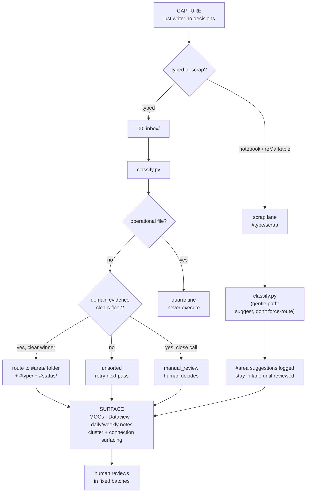
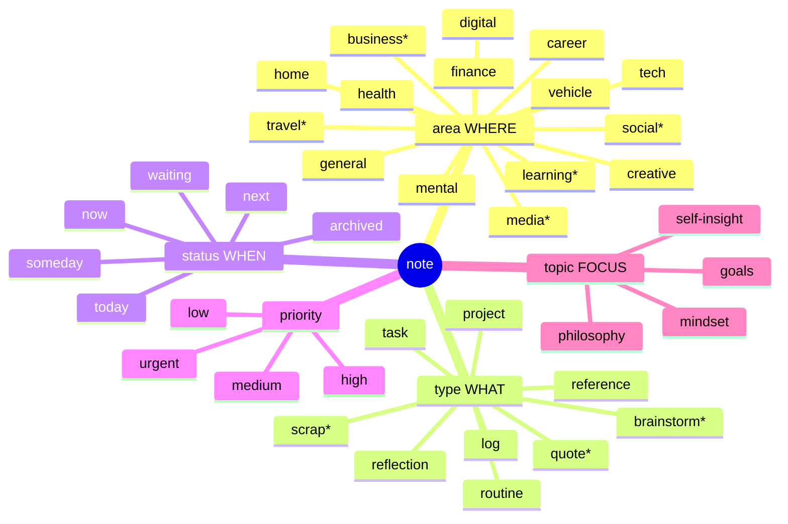

# Capture Quick Reference

> The one rule: **just write.** Everything below is optional. Forgetting any of it costs nothing -
> the classifier still runs. These markers only make the machine's first guess better.

---

## At capture: do nothing but write

No tags. No folder. No filename. No category decision. Dump into `00_inbox/` (typed) or the
scrap lane (notebook / reMarkable). Classification happens later, by machine. The inbox is
allowed to stay non-empty. You are never behind.

**Default capture lane: today's daily note.**
Path: `20_personal/daily/YYYY-MM-DD.md`: template at `.claudian/templates/daily.md` (hybrid:
free-form body + atomic "Quick scraps" list at the bottom). Free prose at top, one-line
scraps (errands, contacts, places, ideas, links) at the bottom. Claudian batch-routes the
scrap-list later via chunk-and-categorize. The daily note is your primary inhabited
surface: capture goes here first, classification later.

---

## Optional inline markers (use any, none, or invent more)

The classifier reads these as hints. They are aids, not requirements.

| Marker | Means | Becomes |
|---|---|---|
| `- [ ]` | task | `#type/task` (native Obsidian) |
| `!` at line start | urgent | `#priority/urgent` |
| `?` at line start | open question to resolve | flagged for surfacing |
| `>` at line start | someday / maybe | `#status/someday` |
| `@Name` | a person | CRM link candidate |
| `[[Note]]` | connection | wikilink (native) |
| `#anyword` | freeform tag | reconciled to canonical via aliases later |
| `+project-name` | project association | `linked_projects` candidate |
| `---` between blocks | separate scraps in one capture | split candidate (not auto-split) |

**Lists:** plain `-` bullets are fine. The system never reformats your prose. Structure you add
is kept; structure you skip is inferred, not imposed.

---

## Tag & namespace cheat sheet

Five namespaces. A note carries one `#area/`, optional `#type/`, `#status/`, `#priority/`, and any `#topic/`.

**`#area/` (WHERE: one per note):**
`finance` · `career` · `health` · `mental` · `creative` · `home` · `digital` · `tech` · `vehicle` · `general`
*proposed-new:* `social` · `learning` · `business` · `media` · `travel`

**`#type/` (WHAT):**
`task` · `reflection` · `project` · `routine` · `log` · `reference`
*proposed-new:* `quote` · `scrap` · `brainstorm`

**`#status/` (WHEN):**
`next` · `now` · `today` · `waiting` · `daily` · `weekly` · `monthly` · `quarterly` · `yearly` · `someday` · `archived` · `reference`

**`#priority/` (URGENCY):**
`urgent` · `high` · `medium` · `low`

**`#topic/` (FOCUS: human-only, add freely):**
`philosophy` · `self-insight` · `mental-reflections` · `social-dynamics` · `mindset` · `goals` · `music` · `hardware` · `errand` ... never auto-assigned.

> Items marked *proposed-new* are not live until promoted via the candidate gate (see `99_system/VAULT_FUNCTION_PLAN.md` §6). Don't rely on them auto-classifying yet.

---

## FAQ: how the system files things

**Where does my note go?**
`classify.py` runs three checks in order: (1) operational quarantine: is this an instruction/script/handoff file? If so, quarantine, never execute it. (2) Domain evidence: does the content clear the evidence floor for an `#area`? (3) Type/status detection. It routes to the winning `#area/` folder + tags, or abstains to unsorted.

**What if two domains both match?**
If the top domain scores 3× the second, it wins. Otherwise -> `manual_review` (you decide). It does not guess between close calls.

**What if it can't classify?**
It abstains: file goes to unsorted/`#status/unsorted`, retried next pass. It never force-tags.

**Why didn't it add a `#topic/` tag?**
By design. `#topic/` is human-only: added after *you* read the note. The machine never invents topics.

**Will it move sentences out of my note into another note?**
No. Never. The system surfaces clusters and *suggests* merges; you do the merge by hand. Auto-recombination of your writing is banned.

**What about sensitive data?**
Anything matching the sensitive pattern is flagged to a human gate and never auto-processed or pushed to git. The workflow already enforces this.

**Do I have to keep the inbox empty?**
No. Process a fixed batch when you feel like it. A non-empty inbox is normal, not a backlog debt.

**How does prioritization reach me if I forget to look?**
Surfacing notes (daily/weekly, auto-generated) push stale and overdue items to you. You don't have to remember a list exists. (See `99_system/AUTOMATION_BACKLOG.md` §F.)

---

## Mind map: categorization flow

> `*` = proposed-new, pending candidate-gate promotion (see `99_system/VAULT_FUNCTION_PLAN.md` §6).
